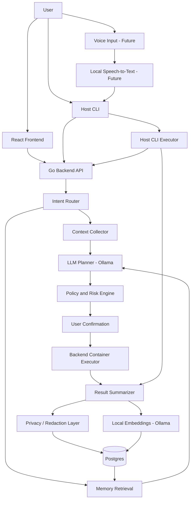
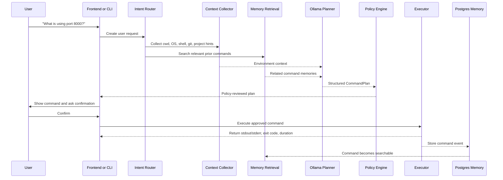
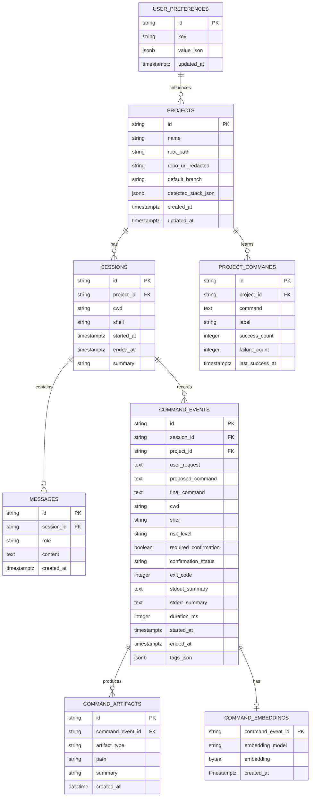

# Local Terminal Agent - System Design

Current implementation status: Phase 5 is complete. The active architecture is a React frontend, Go backend API, host CLI, local Ollama planner, Ollama embedding client, and Postgres memory store.

## 1. Purpose

Build a local-first terminal assistant that converts natural-language requests into safe, reviewable terminal actions, remembers command history as structured events, and helps the user retrieve and reuse useful commands later.

The product should not be framed as only "talk to your terminal." The stronger product is:

A terminal assistant that privately remembers how you work.

## 2. Goals

- Accept typed natural-language requests in a CLI/TUI.
- Generate command plans using a local LLM through Ollama.
- Keep execution controlled by the application, not the LLM.
- Require confirmation for risky, modifying, destructive, privileged, or ambiguous commands.
- Store command events, conversations, project context, and execution summaries locally.
- Support exact and semantic retrieval of prior commands.
- Keep data local by default: local model, local database, local embeddings, no telemetry.
- Add voice input later without changing the core execution pipeline.

## 3. Non-Goals for V1

- Fully autonomous multi-step task execution without user confirmation.
- Browser or desktop automation.
- Cloud sync.
- Team sharing.
- Rich web dashboard.
- Full shell replacement.
- Voice-first UX.

## 4. High-Level Architecture



## 5. Core Principle

The LLM must never directly execute shell commands.

The LLM may produce:

- intent classification
- command proposal
- explanation
- provenance
- risk estimate
- structured plan

The application owns:

- policy enforcement
- confirmation rules
- command execution
- process control
- output capture
- memory writes
- redaction
- audit trail

## 6. Request Lifecycle



## 7. Main Components

### 7.1 CLI / TUI

Primary user interface for V1.

Responsibilities:

- capture user input
- render proposed command plans
- ask for confirmation
- stream command output
- show retrieved command candidates
- allow command edits before execution
- support cancellation for long-running commands

Example:

```text
Termind > what is using port 8000?

Proposed command:
  lsof -i :8000

Reason:
  Lists processes listening on port 8000.

Risk:
  safe

Run? [Y/n/edit]
```

### 7.2 Intent Router

Classifies user requests before planning.

Common intents:

- `execute_command`
- `search_history`
- `explain_command`
- `repeat_command`
- `summarize_session`
- `set_preference`
- `open_project`
- `unknown`

V1 can use simple heuristics plus LLM fallback. Over time this can become a structured LLM call.

### 7.3 Context Collector

Collects non-sensitive local context that helps produce better command plans.

Context examples:

- current working directory
- OS and shell
- git repository root
- git branch
- remote origin URL, optionally redacted
- package manager hints: `pnpm-lock.yaml`, `package-lock.json`, `yarn.lock`
- stack hints: `pyproject.toml`, `requirements.txt`, `go.mod`, `Cargo.toml`, `Dockerfile`
- project-specific successful commands
- recent command failures in the same project

### 7.4 LLM Planner

Uses Ollama to convert request + context + retrieved memories into a structured plan.

The planner returns JSON matching the `CommandPlan` schema.

Example:

```json
{
  "intent": "execute_command",
  "command": "lsof -i :8000",
  "cwd": "/Users/example/projects/api",
  "risk": "safe",
  "requires_confirmation": true,
  "reason": "Lists processes listening on port 8000.",
  "provenance": [
    "The user asked what is using port 8000.",
    "The command is read-only.",
    "lsof is available on macOS."
  ],
  "alternatives": [
    {
      "command": "netstat -vanp tcp | grep 8000",
      "reason": "Alternative network socket inspection command."
    }
  ]
}
```

### 7.5 Policy and Risk Engine

Deterministic gatekeeper.

The LLM risk estimate is advisory. The policy engine computes the final risk level.

Risk levels:

- `safe`: read-only commands like `pwd`, `ls`, `git status`, `lsof`
- `modifying`: filesystem or dependency changes like `mkdir`, `touch`, `npm install`
- `destructive`: data deletion/reset like `rm`, `git reset --hard`, `docker system prune`
- `privileged`: `sudo`, ownership changes, system service changes
- `networked`: commands that send data or touch remote resources
- `unknown`: commands that cannot be confidently classified

Policy examples:

```text
if command contains "sudo":
  risk = privileged
  confirmation = required

if command matches "rm -rf" or "git reset --hard":
  risk = destructive
  confirmation = required

if cwd is "/" or user home:
  confirmation = required

if command writes outside allowed project roots:
  confirmation = required
```

### 7.6 Command Executor

Runs only approved commands.

Responsibilities:

- execute in selected working directory
- stream stdout/stderr
- capture exit code
- support timeout
- support cancellation
- record duration
- optionally support PTY for interactive commands

V1 should support non-interactive commands first. PTY support can be added in V2.

### 7.7 Memory Store

Stores events, not only conversation transcripts.

The important event is:

```text
user intent
proposed command
final command
confirmation
execution result
project context
summary
retrieval metadata
```

The current implementation uses Postgres in Docker:

- structured relational tables
- command-event persistence
- keyword search over command, request, stdout summary, and stderr summary
- a path to embeddings and richer retrieval later

SQLite remains a possible future packaging option for a single-binary desktop/CLI distribution.

### 7.8 Retrieval Layer

Searches previous commands using structured ranking.

Ranking inputs:

- keyword match
- semantic similarity
- same project
- same working directory
- recency
- successful exit code
- user reused command before

Example scoring:

```text
score =
  0.35 semantic_similarity
+ 0.25 keyword_match
+ 0.15 same_project
+ 0.10 same_directory
+ 0.10 recency
+ 0.05 success_bonus
```

### 7.9 Privacy and Redaction

All sensitive memory writes pass through redaction.

Redact:

- API keys
- access tokens
- private keys
- `.env` values
- passwords
- URLs with embedded credentials
- AWS credentials
- GitHub tokens
- SSH private key material

Privacy modes:

```text
local_only:
  LLM: local Ollama
  embeddings: local Ollama
  database: local Postgres in Docker today
  telemetry: disabled
  cloud APIs: disabled

hybrid_optional_future:
  cloud LLM allowed only after explicit user opt-in
```

## 8. Data Model



### 8.1 Tables

#### `projects`

Represents a detected workspace or repository.

```sql
CREATE TABLE projects (
  id TEXT PRIMARY KEY,
  name TEXT NOT NULL,
  root_path TEXT NOT NULL UNIQUE,
  repo_url_redacted TEXT,
  default_branch TEXT,
  detected_stack_json JSONB NOT NULL DEFAULT '{}'::jsonb,
  created_at TIMESTAMPTZ NOT NULL DEFAULT now(),
  updated_at TIMESTAMPTZ NOT NULL DEFAULT now()
);
```

#### `sessions`

Represents a conversation or terminal work session.

```sql
CREATE TABLE sessions (
  id TEXT PRIMARY KEY,
  project_id TEXT REFERENCES projects(id),
  cwd TEXT NOT NULL,
  shell TEXT NOT NULL,
  started_at TIMESTAMPTZ NOT NULL DEFAULT now(),
  ended_at TIMESTAMPTZ,
  summary TEXT
);
```

#### `messages`

Stores chat-like user and assistant messages.

```sql
CREATE TABLE messages (
  id TEXT PRIMARY KEY,
  session_id TEXT NOT NULL REFERENCES sessions(id),
  role TEXT NOT NULL CHECK (role IN ('user', 'assistant', 'system', 'tool')),
  content TEXT NOT NULL,
  created_at TIMESTAMPTZ NOT NULL DEFAULT now()
);
```

#### `command_events`

The central memory object.

```sql
CREATE TABLE command_events (
  id TEXT PRIMARY KEY,
  session_id TEXT NOT NULL REFERENCES sessions(id),
  project_id TEXT REFERENCES projects(id),
  user_request TEXT NOT NULL,
  proposed_command TEXT,
  final_command TEXT NOT NULL,
  cwd TEXT NOT NULL,
  shell TEXT NOT NULL,
  risk_level TEXT NOT NULL,
  required_confirmation BOOLEAN NOT NULL DEFAULT true,
  confirmation_status TEXT NOT NULL CHECK (
    confirmation_status IN ('not_required', 'approved', 'rejected', 'edited')
  ),
  exit_code INTEGER,
  stdout_summary TEXT,
  stderr_summary TEXT,
  duration_ms INTEGER,
  started_at TIMESTAMPTZ NOT NULL DEFAULT now(),
  ended_at TIMESTAMPTZ,
  tags_json JSONB NOT NULL DEFAULT '[]'::jsonb
);
```

#### `command_embeddings`

Optional V2 semantic retrieval.

```sql
CREATE TABLE command_embeddings (
  command_event_id TEXT PRIMARY KEY REFERENCES command_events(id),
  embedding_model TEXT NOT NULL,
  embedding BYTEA NOT NULL,
  created_at TIMESTAMPTZ NOT NULL DEFAULT now()
);
```

#### `project_commands`

Stores learned command shortcuts per project.

```sql
CREATE TABLE project_commands (
  id TEXT PRIMARY KEY,
  project_id TEXT NOT NULL REFERENCES projects(id),
  command TEXT NOT NULL,
  label TEXT NOT NULL,
  success_count INTEGER NOT NULL DEFAULT 0,
  failure_count INTEGER NOT NULL DEFAULT 0,
  last_success_at TIMESTAMPTZ,
  UNIQUE(project_id, command)
);
```

#### `user_preferences`

Stores user-level behavior preferences.

```sql
CREATE TABLE user_preferences (
  id TEXT PRIMARY KEY,
  key TEXT NOT NULL UNIQUE,
  value_json JSONB NOT NULL,
  updated_at TIMESTAMPTZ NOT NULL DEFAULT now()
);
```

## 9. API Design

The current implementation runs a local Go HTTP API. The React frontend and CLI both use these contracts.

Default local base URL:

```text
http://localhost:8000
```

### 9.1 Create Session

```http
POST /v1/sessions
```

Request:

```json
{
  "cwd": "/Users/example/projects/api",
  "shell": "zsh"
}
```

Response:

```json
{
  "session_id": "ses_01JABC",
  "project_id": "prj_01JXYZ",
  "started_at": "2026-08-15T15:00:00Z"
}
```

### 9.2 Submit User Request

```http
POST /v1/requests
```

Request:

```json
{
  "session_id": "ses_01JABC",
  "input": "what is using port 8000?",
  "cwd": "/Users/example/projects/api"
}
```

Response:

```json
{
  "request_id": "req_01J123",
  "intent": "execute_command",
  "plan": {
    "command": "lsof -i :8000",
    "cwd": "/Users/example/projects/api",
    "risk": "safe",
    "requires_confirmation": true,
    "reason": "Lists processes listening on port 8000.",
    "provenance": [
      "The user asked what is using port 8000.",
      "The command is read-only."
    ]
  },
  "policy": {
    "risk": "safe",
    "requires_confirmation": true,
    "warnings": []
  }
}
```

### 9.3 Execute Approved Command

```http
POST /v1/commands/execute
```

Request:

```json
{
  "session_id": "ses_01JABC",
  "request_id": "req_01J123",
  "user_request": "what is using port 8000?",
  "command": "lsof -i :8000",
  "cwd": "/app",
  "shell": "sh",
  "risk_level": "safe",
  "confirmation": {
    "status": "approved",
    "approved_at": "2026-08-15T15:01:00Z"
  }
}
```

When called from the frontend, execution runs inside the Docker backend container. When using the CLI, the CLI executes approved commands on the host and records them through `POST /v1/commands/record`.

Response:

```json
{
  "command_event_id": "cmd_01J789",
  "status": "completed",
  "exit_code": 0,
  "stdout": "COMMAND PID USER FD TYPE DEVICE SIZE/OFF NODE NAME\n...",
  "stderr": "",
  "duration_ms": 238
}
```

Future streaming output can use server-sent events or newline-delimited JSON:

```http
GET /v1/commands/{command_event_id}/stream
```

Event:

```json
{
  "type": "stdout",
  "data": "python3 12345 user ... TCP *:8000 (LISTEN)"
}
```

### 9.4 Search Command Memory

```http
POST /v1/memory/search
```

Request:

```json
{
  "query": "command to kill FastAPI process",
  "project_id": "prj_01JXYZ",
  "cwd": "/Users/example/projects/api",
  "limit": 5
}
```

Response:

```json
{
  "results": [
    {
      "command_event_id": "cmd_01J789",
      "command": "lsof -ti :8000 | xargs kill",
      "user_request": "kill the FastAPI process",
      "cwd": "/Users/example/projects/api",
      "exit_code": 0,
      "score": 0.91,
      "matched_reasons": [
        "same project",
        "semantic match",
        "successful command"
      ],
      "last_used_at": "2026-08-14T19:20:00Z"
    }
  ]
}
```

### 9.5 Explain Command

```http
POST /v1/commands/explain
```

Request:

```json
{
  "command": "lsof -ti :8000 | xargs kill",
  "cwd": "/Users/example/projects/api"
}
```

Response:

```json
{
  "summary": "Finds process IDs listening on port 8000 and sends them to kill.",
  "risk": "modifying",
  "warnings": [
    "This terminates running processes.",
    "It may kill more than one process if multiple match the port."
  ]
}
```

### 9.6 Get Project Context

```http
GET /v1/context/project?cwd=/Users/example/projects/api
```

Response:

```json
{
  "project_id": "prj_01JXYZ",
  "root_path": "/Users/example/projects/api",
  "git": {
    "branch": "main",
    "has_uncommitted_changes": true
  },
  "detected_stack": {
    "language": "python",
    "framework": "fastapi",
    "package_manager": "uv"
  },
  "common_commands": [
    {
      "label": "Run dev server",
      "command": "uvicorn app.main:app --reload",
      "success_count": 8
    }
  ]
}
```

### 9.7 Update Preference

```http
PUT /v1/preferences/{key}
```

Request:

```json
{
  "value": {
    "package_manager": "pnpm"
  }
}
```

Response:

```json
{
  "key": "javascript_defaults",
  "value": {
    "package_manager": "pnpm"
  },
  "updated_at": "2026-08-15T15:10:00Z"
}
```

## 10. Internal Service Interfaces

### 10.1 Planner

```go
type Planner interface {
    Plan(payload models.UserRequestCreate) (string, models.CommandPlan, error)
}
```

Current implementations:

- `OllamaPlanner`: calls Ollama `/api/chat` and parses JSON.
- `RulePlanner`: deterministic fallback.
- `FallbackPlanner`: uses Ollama first, then rules.

### 10.2 Agent Service

```go
type Agent interface {
    CreateRequest(payload models.UserRequestCreate) models.UserRequestResponse
    Execute(payload models.CommandExecuteRequest) models.CommandExecuteResponse
    RecordCommand(payload models.CommandRecordRequest) models.CommandRecordResponse
    SearchMemory(payload models.MemorySearchRequest) models.MemorySearchResponse
    Explain(command string) models.ExplainCommandResponse
    ProjectContext(cwd string) models.ProjectContext
    Phases() models.PhaseResponse
    MockCapabilities() models.MockCapabilityResponse
}
```

Current implementation: `internal/services.AgentService`.

### 10.3 Memory Store

```go
type Store interface {
    RecordCommand(ctx context.Context, payload models.CommandRecordRequest) (models.CommandRecordResponse, error)
    SearchCommands(ctx context.Context, payload models.MemorySearchRequest) (models.MemorySearchResponse, error)
    Close() error
}
```

Current implementation: `internal/memory.PostgresStore`.

## 11. Suggested Project Structure

```text
cli-agent/
  backend/
    cmd/
      server/      HTTP API entrypoint
      termind/     host CLI entrypoint
    internal/
      api/         routes, validation, JSON responses
      config/      env configuration
      memory/      Postgres store
      models/      API contracts
      planner/     Ollama planner and rule fallback
      services/    agent service, policy, execution, roadmap metadata

  frontend/
    src/           React/Vite product UI

  database/
    init/          Postgres schema

  docs/
    phase_plan.md

  tests/
    integration/   pytest API tests

  docker-compose.yml
  Makefile
  README.md
```

## 12. Build Plan

### Milestone 1: Command Workbench

- React command workbench
- Go API contracts
- rule fallback planner
- policy decision scaffold
- CLI record path
- Docker Compose stack

### Milestone 2: Local LLM Planning

- Ollama client
- structured `CommandPlan` JSON
- invalid-output fallback
- irrelevant request gating
- planner/model runtime config

### Milestone 3: Safe Execution

- backend process runner
- explicit approval requirement
- stdout/stderr/exit-code capture
- destructive command blocking
- command timeout
- command event persistence

### Milestone 4: Persistent Memory

- session persistence
- message persistence
- learned project commands
- richer keyword search
- command search UI

### Milestone 5: Retrieval-Augmented Planning

- retrieve recent and relevant commands before planning
- add project command memory
- show provenance for suggestions

### Milestone 6: Semantic Search

- local embeddings through Ollama - started
- embedding storage for new command events - started
- embedding backfill, semantic query retrieval, and hybrid memory ranking
- hybrid ranking

### Milestone 7: Voice Input

- voice capability metadata and runtime config
- local speech-to-text adapter spike
- transcript creation endpoint
- microphone input with editable transcript confirmation
- same request pipeline as typed input
- CLI voice command wrapper

## 13. Open Design Decisions

- Should the CLI stay simple, or should it grow into a richer TUI?
- Should the local API remain Docker-first, or become an installable host daemon?
- Should full stdout/stderr be stored, or only redacted summaries by default?
- Which commands are allowed to bypass confirmation?
- Should users be able to define per-project command aliases?
- Should memory be encrypted at rest?
- Should project detection be path-based, git-root-based, or both?

## 14. Recommended V1 Architecture Choice

Use the current local Go API plus host CLI split:

```text
React frontend
  -> Go API in Docker
  -> Ollama on host
  -> Postgres in Docker

Host CLI
  -> Go API for planning and policy
  -> local host shell for execution
  -> Go API for command-event recording
```

This preserves clear boundaries while supporting both a browser workbench and a real terminal workflow. The next split should move policy and execution into dedicated packages once streaming, cancellation, and richer rules are added.
